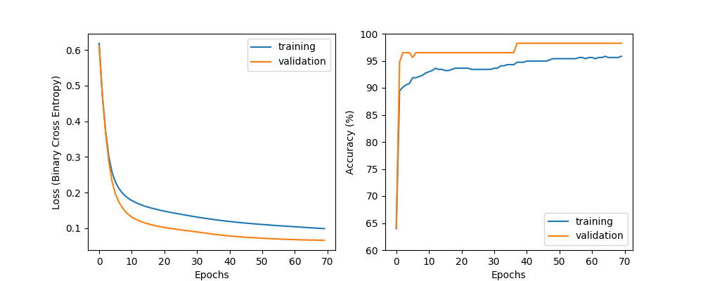

# Multilayer Perceptron

This repository contains a custom-built Artificial Neural Network (Multilayer Perceptron) designed to classify breast cancer tumors as malignant or benign. Developed as part of the 42 Barcelona core curriculum, this project focuses on understanding the underlying math and logic of machine learning by building the core algorithms completely from scratch.

## Features

* **Built from Scratch:** No machine learning frameworks (like TensorFlow or PyTorch) were used. The forward pass, backpropagation, and gradient descent algorithms were implemented entirely by hand using fundamental math.
* **Customizable Architecture:** The network's topology, including the number of layers, neurons per layer, activation functions, and loss functions, is completely modular and defined via a local `./model/architecture.json` file.
* **Mini-Batch Gradient Descent:** Supports dynamic batch sizing for optimized, iterative weight updates during training.
* **Data Splitting:** Automatically splits the dataset into training and validation sets based on user-defined ratios to test the model's accuracy on unknown examples.
* **Visual Evaluation:** Generates a Loss/Accuracy vs. Epoch plot using Matplotlib at the end of the training phase to easily evaluate the model's learning curve.

## The Dataset

The model trains on a breast cancer dataset. It analyzes features describing the characteristics of cell nuclei (such as radius, texture, perimeter, area, and smoothness) to predict a diagnosis label of either `M` (Malignant) or `B` (Benign).

## Tech Stack

The project relies strictly on foundational Python libraries:
* **NumPy:** For matrix operations and linear algebra.
* **Pandas:** For loading and manipulating the CSV dataset.
* **Matplotlib:** For rendering the learning curves.

## Project Structure

* `main.py`: The entry point for the program, handling command-line arguments and routing to training or prediction modes.
* `./model/architecture.json`: Configuration file specifying the network topology.
* `./model/parameters.json`: Storage file for the learned weights and biases after a successful training run.

## Usage

The main interface is run through `main.py` and requires specifying the operational mode (`--training` or `--prediction`).

### Command Line Arguments

* `--training` / `--prediction`: **(Mandatory)** Defines the execution mode. 
* `--epochs <int>`: Number of training iterations over the dataset (Default: `80`).
* `--learningRate <float>`: The step size for the gradient descent (Default: `0.01`).
* `--validationRatio <float>`: The proportion of data used for training vs. validation, between 0 and 1 (Default: `0.7`).
* `--batchSize <int>`: The number of datapoints processed in one forward/backward pass (Default: Full dataset).

### Examples

**Training the model:**
```bash
python3 main.py --training --epochs 70 --learningRate 0.5 --validationRatio 0.8 --batchSize 455
```

## Results:

During the training phase, the program evaluates the model's performance on both the training and validation datasets. At the end of the process, it generates its learning curves to visualize the gradient descent (loss and accuracy - epochs):

